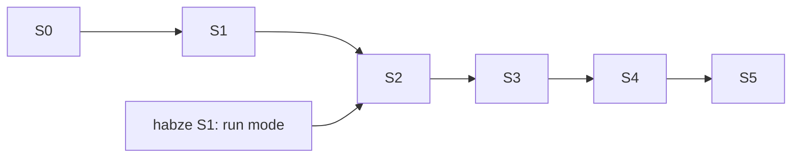

# Roadmap

- **Status:** Agreed with the maintainer on 2026-10-01
- **Reads with:** [`SPEC.md`](SPEC.md) says what Bellboy is; this file says in what order it gets
  built. The board is <https://github.com/users/shoraLBRT/projects/4>.

**Work is taken from the board**, by the habze rule: the first eligible issue of the earliest stage,
then by Priority, then by board position; an issue whose *blocked by* issues are still open waits.
Issues are the source of truth for what is done; this file holds what the board cannot: the goal of
each stage and what "done" means for it.

- **A stage is done when its exit criterion has been shown to work** — run, clicked through, or
  tested — not when its issues are closed.
- **One issue per branch, one PR per issue.** A partially done issue stays open with a comment saying
  exactly what is left.
- **Later iterations are not issues.** They live in [`SPEC.md`](SPEC.md) §12.

---

## Stages

| Stage | Goal | Exit criterion |
| --- | --- | --- |
| **S0 · Ground** | Something to build on | The solution builds and tests green in a required CI check; `main` is protected; configuration is validated at startup; the store migrates |
| **S1 · See** | The owner sees what can be run | From Telegram, with two connected projects, the owner sees their next tasks in the habze order and the current usage with its age |
| **S2 · Run one task** | One task, end to end | A single run started from Telegram ends with a PR on GitHub and a run report in Telegram |
| **S3 · Merge and loops** | The owner hands over a window, not a task | A `reserve` loop merges at least two tasks by policy and stops on one of its conditions with a summary |
| **S4 · Speak first** | Bellboy starts the conversation | Over a day, Bellboy proposes work at a reset and reminds before a window ends, unasked and without opening a window by probing |
| **S5 · Self-host and deploy** | Runs without the owner's machine; others can run their own | Bellboy runs on the chosen host and survives a restart mid-run; the self-hosting guide has been followed once from a clean clone |

Until S5 Bellboy runs on the owner's machine.

---

## S0 · Ground

| # | Issue | Priority | Blocked by |
| --- | --- | --- | --- |
| [#1](https://github.com/shoraLBRT/bellboy/issues/1) | Solution skeleton and module boundaries | P0 | — |
| [#2](https://github.com/shoraLBRT/bellboy/issues/2) | CI and protection of main | P0 | #1 |
| [#3](https://github.com/shoraLBRT/bellboy/issues/3) | Configuration and secrets | P0 | #1 |
| [#4](https://github.com/shoraLBRT/bellboy/issues/4) | Store: SQLite with migrations | P1 | #1 |
| [#5](https://github.com/shoraLBRT/bellboy/issues/5) | Choose a licence — *the owner* | P2 | — |

## S1 · See

| # | Issue | Priority | Blocked by |
| --- | --- | --- | --- |
| [#6](https://github.com/shoraLBRT/bellboy/issues/6) | Spike: GitHub facts the task source relies on | P0 | — |
| [#7](https://github.com/shoraLBRT/bellboy/issues/7) | Task source: eligible tasks in order | P0 | #6, #3 |
| [#8](https://github.com/shoraLBRT/bellboy/issues/8) | Usage probe | P0 | #3, #4 |
| [#9](https://github.com/shoraLBRT/bellboy/issues/9) | Telegram frontend: owner, menu, languages | P0 | #3, #4 |
| [#10](https://github.com/shoraLBRT/bellboy/issues/10) | Work proposal on demand | P1 | #7, #8, #9 |

## S2 · Run one task

| # | Issue | Priority | Blocked by |
| --- | --- | --- | --- |
| [#11](https://github.com/shoraLBRT/bellboy/issues/11) | Spike: firing a routine from Bellboy's host | P0 | #3 |
| [#12](https://github.com/shoraLBRT/bellboy/issues/12) | Routine client | P0 | #11, #4 |
| [#13](https://github.com/shoraLBRT/bellboy/issues/13) | Run tracking | P0 | #12, #7, [habze#6](https://github.com/shoraLBRT/habze/issues/6) |
| [#14](https://github.com/shoraLBRT/bellboy/issues/14) | Start a single run, and the run report | P0 | #10, #13 |

S2 needs habze's run mode (habze S1). The first live runs should be on small issues of habze or
Bellboy itself, before ritocode.

## S3 · Merge and loops

| # | Issue | Priority | Blocked by |
| --- | --- | --- | --- |
| [#15](https://github.com/shoraLBRT/bellboy/issues/15) | Merge policy, holds and violations | P0 | #13 |
| [#16](https://github.com/shoraLBRT/bellboy/issues/16) | Loops: reserve and full | P0 | #15, #14 |
| [#17](https://github.com/shoraLBRT/bellboy/issues/17) | Resume after the limit | P1 | #16 |

## S4 · Speak first

| # | Issue | Priority | Blocked by |
| --- | --- | --- | --- |
| [#18](https://github.com/shoraLBRT/bellboy/issues/18) | Proposal at window reset | P1 | #10, #13 |
| [#19](https://github.com/shoraLBRT/bellboy/issues/19) | Window-end reminder | P2 | #18 |

## S5 · Self-host and deploy

| # | Issue | Priority | Blocked by |
| --- | --- | --- | --- |
| [#20](https://github.com/shoraLBRT/bellboy/issues/20) | Hosting decision — *the owner chooses* | P1 | — |
| [#21](https://github.com/shoraLBRT/bellboy/issues/21) | Self-hosting guide for forks | P1 | #3 |
| [#22](https://github.com/shoraLBRT/bellboy/issues/22) | Container and deployment | P1 | #20 |
