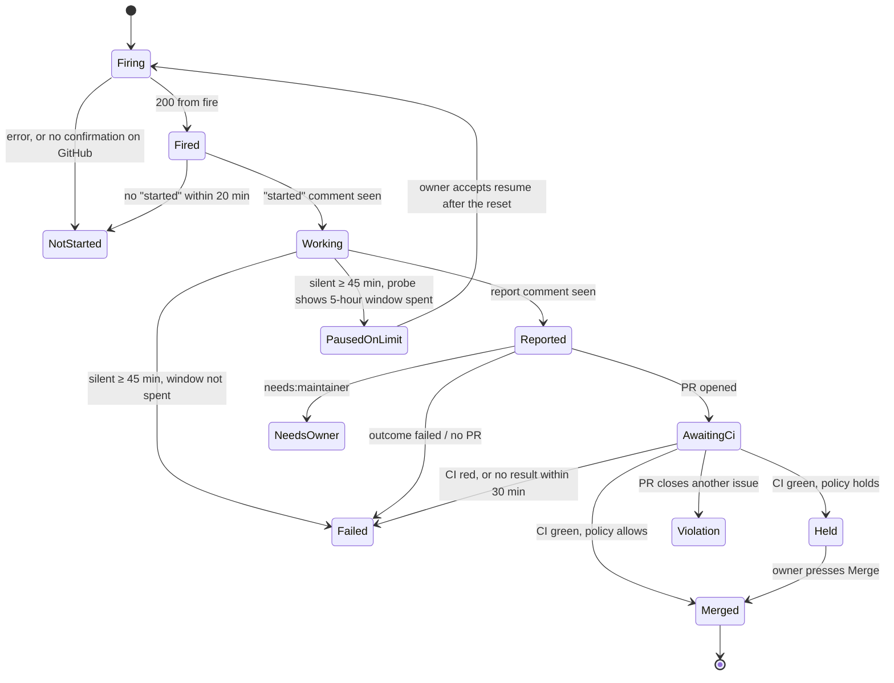

# Bellboy — Specification

- **Status:** Agreed with the maintainer on 2026-10-01
- **Reads with:** [`ROADMAP.md`](ROADMAP.md) says in what order this gets built;
  [`PROJECT_STATE.md`](PROJECT_STATE.md) says what exists now. The way of working that every
  connected project follows — including this one — is the [habze](https://github.com/shoraLBRT/habze)
  standard.

---

## 1. What Bellboy is

Bellboy is a messenger assistant that sits between one developer and the Claude Code agents that
work on their GitHub projects. It does three things:

1. **Offers work.** When Claude usage is available — typically when the 5-hour window resets — it
   messages the owner with the current usage and the next tasks of every connected project.
2. **Starts work.** The owner picks a project, a task and a mode with buttons; Bellboy starts a
   Claude Code cloud session on that task.
3. **Reports work.** When a task ends, Bellboy reports what happened — PR, CI, merge, usage spent,
   questions for the owner — and, in a loop mode, starts the next task.

The name is the job: a bellboy carries messages and luggage and reports back. **It does not decide
what to work on and does not do the work.** What to work on comes from each project's backlog; the
work is done by Claude Code in Anthropic's cloud.

### 1.1 Who it is for

One owner per installation. The first installation serves its author. Any developer can fork the
repository and run their own installation for their own projects: nothing about the author, their
projects or their infrastructure is in the code or the repository — it all lives in configuration
on the host.

### 1.2 What it is not

- Not a chat interface to Claude. Bellboy contains **no language model** and never interprets free
  text. Every interaction is a button or a fixed command.
- Not a planner. It never reorders, creates or edits backlog items beyond setting a board status.
- Not a runner. It never executes project code; it calls the Anthropic and GitHub APIs and runs the
  `claude` CLI only for the fixed usage probe (§5.1).

---

## 2. Words used here

| Word | Meaning |
| --- | --- |
| **Owner** | The one person an installation serves, identified by their messenger user id |
| **Project** | A GitHub repository that follows the habze standard and is connected in Bellboy's configuration: repository, board, routine |
| **Board** | The project's GitHub Projects board — the project's backlog |
| **Task** | An issue on a project's board that an agent may take (§4.1) |
| **Routine** | A Claude Code cloud routine with an API trigger, one per project, set up as habze describes. Its model is always Opus |
| **Fire** | One call to a routine's API trigger. One fire creates one cloud session |
| **Run** | Bellboy's record of one fire: one task, one cloud session, at most one PR |
| **Mode** | How many tasks a request covers: `single`, `reserve`, `full` (§6.2) |
| **Loop** | A `reserve` or `full` request: a sequence of runs, one after another |
| **Usage** | The two Claude plan windows: the 5-hour window and the weekly window, each a utilisation (0–100 %) and a reset time |
| **Probe** | One tiny Claude request whose only purpose is to read usage (§5.1) |
| **Hold** | A PR that passed CI but that the merge policy does not let Bellboy merge on its own (§7) |

---

## 3. The setting it works in

These facts shape the design. They come from
[shoraLBRT/ritocode#146](https://github.com/shoraLBRT/ritocode/issues/146) (verified 2026-09-30)
unless marked otherwise.

- **Claude Pro plan.** Usage is shared by claude.ai, the desktop app and cloud sessions. A heavy
  autonomous day can spend about a quarter of the weekly window.
- **Cloud sessions and routines are included in Pro.** A routine with an API trigger is started by
  `POST https://api.anthropic.com/v1/claude_code/routines/{trigger}/fire` with a per-routine token.
  The response carries the session id and URL. **There is no completion callback, no public run
  status API and no idempotency key.** The outcome of a session is visible only on GitHub.
- **Inside a cloud session**, GitHub REST works (issues, comments, PRs), GraphQL is limited (so the
  board is invisible), pushes go only to `claude/*` branches, and `api.telegram.org` is blocked.
  Cloud sessions do not see user-level skills; skills reach them through the repository (habze).
- **Usage has no public API**, but `claude -p … --output-format stream-json --verbose` emits a
  `rate_limit_event` carrying both windows' utilisation and reset time. This works on any machine
  with a Claude login, including a server with a `claude setup-token` token.
- **A probe outside an active 5-hour window opens a new window.** Probing at 14:00 when the owner
  starts working at 16:00 leaves them three hours of window instead of five. [assumed from how the
  windows work; Bellboy is designed as if it is true]
- **Anthropic does not serve Russia.** Anything that calls Anthropic — the fire and the probe —
  must run in a [supported country](https://www.anthropic.com/supported-countries). Bellboy calls
  Anthropic directly; there is no relay. Where it is hosted is decided in stage S5 (§11).
- **User-owned GitHub Projects boards can be read only with a classic personal access token.**
  Fine-grained tokens and GitHub Apps do not support them. Bellboy therefore uses two GitHub tokens
  (§9.2).

---

## 4. Tasks: what an agent may take, and in what order

The rules below are defined by the habze standard; Bellboy implements them exactly, and the
`session` skill implements the same rules when the owner works by hand, so both always agree on
"the next task".

### 4.1 Eligibility

An issue is a task when **all** of these hold:

1. It is open and on the project's board with Status **Todo**.
2. It was opened by the owner, **or** carries the label `accepted` (only people with triage rights
   can set labels — this is how the owner admits someone else's issue).
3. It is in a milestone (a stage).
4. No issue it is *blocked by* (GitHub's native issue dependency) is still open.
5. It does not carry the label `needs:maintainer`.

### 4.2 Order

Tasks are ordered by:

1. **Milestone**, earliest stage first (by milestone title, which habze numbers `S0 …`, `S1 …`).
2. **Priority**, the board's Priority field, `P0` before `P1` before `P2`; no priority sorts last.
3. **Board position** — the order the owner left the items in on the board.

### 4.3 What Bellboy writes to the board

Only the Status field: **In progress** when a run for the task is fired. Moving to **Done** is left
to GitHub's built-in board workflows (item closed, PR merged). Bellboy never edits issue titles,
bodies, labels or milestones.

---

## 5. Usage

### 5.1 The probe

Bellboy reads usage by running, on its own host:

```text
claude -p "ok" --model haiku --max-turns 1 --output-format stream-json --verbose
```

and taking the first `rate_limit_event` from the output:
`rate_limit_info.unifiedWindows.five_hour` and `.seven_day`, each `{utilization, resetsAt}`. The
event is not part of the documented SDK types, so it is parsed defensively: a missing or malformed
event is a **failed probe**, reported as "usage unknown", never as zero.

Every probe is stored as a **usage snapshot** with the time it was taken. Every number Bellboy
shows carries its age ("week 27 % as of 09:14").

### 5.2 When Bellboy probes

Because a probe outside an active window opens a new one (§3), Bellboy probes only when that
cannot cost the owner anything:

| When | Probe? |
| --- | --- |
| The 5-hour window is known to be active (a snapshot's `resetsAt` is in the future) | Yes, freely |
| Right before firing a run (the run is about to open the window anyway) | Yes |
| The owner presses **Refresh usage** while no window is known to be active | Only after a confirmation: "this opens a new 5-hour window" |
| At a window reset, to announce it | **No.** After a reset the 5-hour window is 0 % by definition; the weekly number comes from the last snapshot, with its age |

The cloud session itself also probes at the end of every task and puts the numbers in its report
(§6.4), so after each run Bellboy has fresh usage without probing.

### 5.3 What usage drives

- The `reserve` and `full` loops decide whether to start the next task from it (§6.2).
- Proactive messages are scheduled from the last known `resetsAt` (§8).
- Each run report shows the usage before and after the task, so the owner sees what an Opus task
  costs.

---

## 6. Runs

### 6.1 One run = one cloud session = one task

A cloud session works on **exactly one** issue. It never merges and never takes a second issue.
Everything that spans several tasks — merging, deciding whether to continue, choosing the next task
— is done by Bellboy between sessions. This keeps every session's context fresh, keeps the merge
decision outside the agent, and gives a report per task.

### 6.2 Modes

| Mode | Bellboy does |
| --- | --- |
| `single` | One run on the chosen task. Merges it if the policy allows (§7). Stops |
| `reserve` | Runs tasks one after another, starting from the chosen one and continuing in board order (§4.2). **Does not start** a task once the 5-hour window is ≥ 80 % used |
| `full` | The same loop, with no reserve. Does not start a task once the 5-hour window is ≥ 95 % used — a task started that late would be cut off almost at once |

A loop starts the next task only after the previous one has been **merged**, because the next task
builds on it. Thresholds are configuration, with the values above as defaults.

**A loop stops** — and Bellboy sends a loop summary — when:

1. the usage threshold of its mode is reached, or the weekly window is ≥ 95 % used;
2. a run ends with a question for the owner (`needs:maintainer`);
3. a PR is held or is a violation (§7) — the next task would build on unmerged work;
4. two runs in a row fail;
5. there are no more eligible tasks.

Stage boundaries do **not** stop a loop. There is no stop button: a loop ends only on the
conditions above. (The owner can still stop a cloud session by hand in claude.ai; Bellboy then sees
a run without a report and treats it as failed.)

**Concurrency.** The data model allows several runs at once, but in the MVP Bellboy runs **one run
at a time across all projects**. Parallel runs — at most one per repository — are a later iteration
(§12).

### 6.3 Lifecycle of a run



- **Firing.** Bellboy probes, writes the run (with a fresh random run id) to its store *before*
  calling the fire endpoint, then fires. **A fire is never retried blindly**: on a timeout or a 5xx
  the run waits for the "started" comment; only if none appears is it `NotStarted`, and only then
  may the owner fire again. A 429 (the routine's hourly fire cap) is reported with its
  `Retry-After`.
- **Silence** means no new comment from the run and no new commit on its branch.
- Timeouts (20 min to start, 45 min of silence, 30 min of CI) are configuration.

### 6.4 The run contract (between Bellboy and the routine)

The routine's prompt, defined by habze, runs the habze `session` skill in **run mode**. The
contract, owned by habze and implemented on both sides:

- **Fire payload** (the `text` of the fire request), JSON:
  `{"bellboy": 1, "run": "<run id>", "repo": "<owner/name>", "issue": <number>, "kind": "new" | "resume"}`.
  The payload carries no secrets.
- **Started comment** on the issue, posted before any work:
  `<!-- bellboy:started run=<run id> -->` plus a human line.
- **Report comment** on the issue, posted last:
  `<!-- bellboy:report {json} -->` plus a human summary. The JSON holds `run`, `outcome`
  (`pr_opened` | `needs_maintainer` | `failed` | `nothing_to_do`), `pr` (number or null), `summary`
  (a few sentences), `questions` (list of strings) and `usage` (the session's own probe:
  both windows' utilisation and reset time).
- **Branch** `claude/<issue>-<slug>`; the PR says `Closes #<issue>` for that issue **only**.
- `kind: "resume"` means: continue the open branch and PR of this issue instead of starting over.
- The session commits and pushes after every phase of the skill, so a session cut off by the usage
  limit loses nothing.

**Trust.** Issues of public repositories can be commented on by anyone, and the run id becomes
public with the started comment. Bellboy therefore accepts `bellboy:` markers **only from the
configured trusted authors** (the GitHub identity cloud sessions post as) and only with the run id
of a run it fired.

### 6.5 The run report

Sent when a run reaches an end state. It holds:

- the project, the issue (title, link) and the mode;
- the outcome: merged / held / violation / needs you / failed / not started / paused on limit;
- the PR (link, CI result) and the session link;
- the session's summary and its questions for the owner, verbatim;
- usage before and after the task, both windows, with reset times;
- what is left: the number of eligible tasks remaining in the project, and the progress of the
  current milestone.

A loop also ends with a **loop summary**: tasks done, PRs merged, why it stopped, usage now.

---

## 7. Merge policy

Bellboy merges a PR — with the repository's default merge method, deleting the branch — only when
**all** hold:

1. Every required check is green. (Branch protection on `main`, required by habze, enforces this
   on GitHub's side too; Bellboy's check is not the only guard.)
2. The PR touches none of the **protected paths**: `.github/workflows/`, `.claude/`, `CLAUDE.md`,
   `AGENTS.md`, and the habze-managed files. An agent must not loosen its own rules unattended.
3. The diff is at most **1500 changed lines** (configuration).

A PR that fails rule 2 or 3 is **held**: Bellboy shows it with a **Merge** button for the owner.

A PR that closes or references for closing **any issue other than the one fired** is a
**violation**. It must not exist — the habze skill never does this — so Bellboy does not merge it,
offers no Merge button, and reports it as a violation for the owner to deal with on GitHub.

CI red → the run is failed; Bellboy never merges red.

---

## 8. Messages Bellboy sends on its own

There are no quiet hours.

| Trigger | Message |
| --- | --- |
| The last known `resetsAt` of the 5-hour window passes | **Work proposal**: "The 5-hour window has reset: 0 %. Week: N % as of HH:MM, resets on …", then up to three next tasks per project, with buttons |
| 60 minutes before the end of an active window, and no run since the last report | **Window-end reminder**: fresh usage (a probe is free inside the window), time left, and the work proposal |
| A run or a loop ends | Run report / loop summary (§6.5) |
| A run is paused on the limit | "Paused on the limit until HH:MM"; at that time, a proposal to resume |
| A PR is held or is a violation | The PR, the rule it tripped, and for a hold the **Merge** button |

If Bellboy knows no `resetsAt` (no snapshot in the current window), it sends no reset proposal; the
owner can always open the proposal by hand.

---

## 9. Interface, access and security

### 9.1 Messenger interface (Telegram in the MVP)

- **Buttons only.** The main menu: **Tasks** (the work proposal), **Usage** (with refresh, §5.2),
  **Status** (the active run or loop), **Settings** (language). A start request is: project → task
  → mode → confirmation screen (shows the task, the mode and current usage, and warns when the
  weekly window is ≥ 80 %) → **Start**.
- **Languages:** Russian and English, chosen in Settings. Every text lives in resource files.
- **Owner only.** Updates from any other user id are ignored without a reply.
- **Long polling.** The host opens no inbound port.
- Button callbacks carry short references to rows in Bellboy's store, never raw data (Telegram
  limits callback data to 64 bytes, and it must not be forgeable into arbitrary commands).

### 9.2 Credentials

All secrets come from the host's environment or the .NET user-secrets store, never from the
repository, and never appear in logs.

| Secret | Scope | Used for |
| --- | --- | --- |
| Telegram bot token | — | The messenger frontend |
| GitHub **fine-grained** token | Only the connected repositories: Issues RW, Pull requests RW, Contents R, Commit statuses R, Checks R, Metadata R. Contents **write** only if the repository's merge requires it (verified in S0) | Issues, comments, PRs, CI status, merge |
| GitHub **classic** token | **Only** the `project` scope — no `repo` | Reading the boards and setting Status. A leak can disturb a board, not code |
| Routine fire token, one per project | Can only fire its own routine | Starting runs |
| Claude OAuth token (`claude setup-token`) | The owner's subscription | The usage probe. **The most valuable secret**: a leak lets someone spend the owner's plan |

### 9.3 Guarantees

- Bellboy never executes code from a repository, and runs `claude` only with the fixed probe
  arguments.
- Bellboy merges only under §7; branch protection on GitHub backs it up.
- Bellboy trusts only its own markers from trusted authors (§6.4).
- Every action Bellboy takes on GitHub or Anthropic is recorded in its store with the run it belongs
  to.

---

## 10. Architecture

A **modular monolith** in C# on .NET 10, one process.

| Module | Holds | May reference |
| --- | --- | --- |
| `Bellboy.Core` | The domain (project, task, run, loop, usage snapshot, proposal, policy), the use cases, and the **ports** it needs: task source, code host, routines, usage probe, store, notifier, clock | nothing |
| `Bellboy.GitHub` | Task source (board via GraphQL with the classic token), code host (REST with the fine-grained token): comments, PRs, checks, merge, board status | Core |
| `Bellboy.Claude` | Routine fire client, usage probe (runs the CLI, parses stream-json) | Core |
| `Bellboy.Telegram` | The messenger frontend: renders Core's notifications into texts and buttons, maps buttons to Core's commands, holds the RU/EN resources | Core |
| `Bellboy.Persistence` | The store: SQLite through EF Core, with migrations | Core |
| `Bellboy.Host` | Composition, configuration, background services (scheduler, GitHub poller, messenger polling) | all |

Rules:

- **Core knows no transport.** It publishes notifications as typed records (`RunFinished`,
  `WorkProposed`, `PrHeld`, …) and accepts typed commands (`ProposeWork`, `StartRequest`,
  `RefreshUsage`, `MergeHeld`, …). It never produces user-facing text. A second frontend — a web
  page, another messenger — is another module next to `Bellboy.Telegram`, with no change to Core.
- **Adapters do not reference each other.** Module boundaries are enforced by architecture tests.
- **Time is a port.** Every timeout and schedule goes through the clock port, so the run lifecycle
  is tested with a fake clock, deterministically.
- **GitHub is polled**, not pushed: every minute while a run is active, every 15 minutes otherwise.
  No webhooks, no inbound port.
- **Configuration** lists the owner (messenger user id, language, time zone for display) and the
  projects (repository, board number, routine fire URL, trusted authors, policy overrides). It is
  validated at startup; a project that is misconfigured or whose board lacks the habze fields is
  reported to the owner and left out, not half-used.
- An HTTP API in front of Core comes only with a second frontend that needs it.

---

## 11. Hosting

Decided in stage S5, not before. Until then Bellboy runs on the owner's machine. The constraints the
decision has to meet:

- the host is in a country Anthropic serves, because Bellboy fires routines and probes usage;
- it can reach Telegram and GitHub;
- it can run the `claude` CLI for the probe;
- it keeps a small SQLite file and survives restarts without losing an active run (runs are
  recovered from the store and GitHub on startup).

The S5 decision is recorded as an ADR with the options compared, including cost.

---

## 12. Not in the MVP

Each becomes an issue when it is planned.

- **Planned work ("standing orders").** "The window resets at 03:00 — work through ritocode until
  morning?" — the owner approves a plan ahead of time, within a weekly budget. The MVP always asks
  at the moment of starting.
- **Parallel runs**, at most one per repository, e.g. a `full` loop on one project and a small
  single task on another.
- **Answering the agent's questions from the messenger**, posted back to the issue as the owner.
- **Creating a task from the messenger** — it would become an issue first, so the standard still
  holds.
- **Another frontend** and the HTTP API it needs.
- **The desktop app as a runner.**
- **Several owners in one installation.** Forking covers other developers.
- **Connecting projects from the messenger** instead of the configuration file.

---

## 13. Decisions and why

| Decision | Why |
| --- | --- |
| Work runs in Anthropic's cloud routines | Included in Pro, nothing to host for the work itself, proven on ritocode's full verification |
| Bellboy calls Anthropic directly; no relay | A relay existed only to serve a host in Russia, and cost a second repository with secrets. The host must be in a supported country instead |
| One cloud session per task; Bellboy owns loops and merges | Fresh context per task, merge rules enforced outside the agent, a report per task, and the board — invisible in the cloud — is read by Bellboy |
| No language model in Bellboy | Predictable buttons; a model in the bot would need paid API access outside the Pro plan |
| Usage from the CLI's `rate_limit_event` | The only usage reading that is official, works without the desktop app, and works in the cloud |
| Probe only where it cannot open a window | A careless probe would shorten the owner's next window |
| Backlog on GitHub Projects, read with a project-only classic token | The owner's preferred backlog tool; GitHub allows nothing narrower for user-owned boards |
| Order: milestone → priority → position | New issues created by agents find their place without the owner dragging them |
| Always Opus | The owner's choice; reports show the cost per task |
| No stop button | A loop ends on its own conditions; a session can be stopped by hand in claude.ai |
| Stage boundaries do not stop a loop | The owner wants to be called only when needed |
| Modular monolith, Core with ports | One process to run, frontends replaceable, boundaries enforced by tests |
| No quiet hours | The owner's choice |
| Hosting decided last | Nothing before S5 depends on it |

---

## 14. To verify

Facts the design leans on that are not yet verified; each is checked by an issue before the code
that depends on it.

| Fact | Checked in |
| --- | --- |
| Board items can be read in board position with the project-only classic token; Priority and Status fields are readable and Status writable | S1 spike |
| Native "blocked by" dependencies can be read through the API | S1 spike |
| What the fire endpoint returns when the plan quota is exhausted | S2 spike |
| Which GitHub identity a cloud session's comments are posted as (the trusted author) | S2 spike |
| Whether merging through the API needs Contents write on the fine-grained token | S0 / S3 |
| A probe outside an active window opens a new window | S1 spike, observed once |
